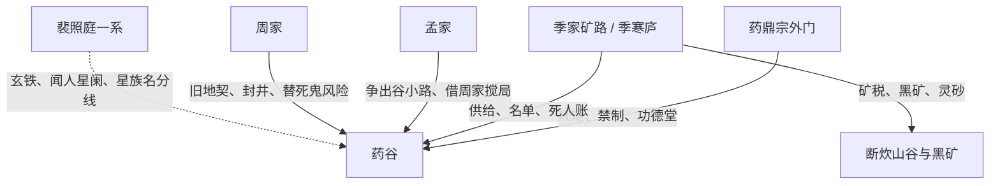

# 第一批：地理与势力骨架

## 盖天法界整体地理结构

条目名：盖天法界

定稿内容：盖天法界不是普通大陆，而是被天盖扣死的盘状下位界域。地面可被理解为向内弯曲的浅盘，山谷、矿脉、灵田都被压在同一层资源笼里；天盖同时是物理壳、灵气过滤层和认知边界。底层人日常看见的是灰天、矿火、药田和宗门规矩，直到筑宫境末端或天痕裂开，才会真正意识到“天”是可以被计算和打穿的壳。

推演依据：设定文档第 6 行“地法覆槃” + 设定文档第 8 行“资源的极度匮乏” + 大纲第 8 章“若天盖压死众生，那就想法子算它” + 大纲第 100 章“真正打穿天盖并活着出去”

推演逻辑：盘状封闭界域 + 资源内耗 + 主角把天盖纳入账本 → 盖天法界的地理本质是资源牢笼，不是单纯地图背景。

决策备注：定为“资源牢笼”；枪毙“仙山福地”“凡界大陆”等泛化方案，问题是削弱压迫。

## 药谷位置与结构

条目名：药谷

定稿内容：药谷位于盖天法界下位山谷，是药田、尸坑、废炉区、药库、功德堂、矿路入口和黑市暗沟互相咬合的底层资源节点。药谷表面产药，实际负责把低等药童、药泥、尸货和矿脉损耗送入更大的宗门账本；废炉区在药谷北侧，地窖属于旧炼制设施遗留，能藏下坠星相关残器。

推演依据：第 1 章“药泥收购点在药谷最东边……功德堂” + 第 3 章“废炉区在药谷的最北边” + 第 4 章“药库在戌时封门” + 第 5 章“黑市在断炊山东边，入口是个矿洞”

推演逻辑：药泥收购 + 药库封门 + 废炉遗留 + 黑市矿洞入口 → 药谷是药材生产、尸货处理、矿路交易的复合节点。

决策备注：保留“药谷”为核心地名；枪毙另起山名，因前 10 章锚点已足够强。

## 药谷与季家矿的从属关系

条目名：药谷-季家矿关系

定稿内容：药谷名义上归药鼎宗外门管辖，日常账目却被季家矿路深度控制。季寒庐以矿主身份控制药谷周边三成以上灵石产出和外门供给，药谷断粮、深井班名单、清淤工招募、矿奴损耗都能被他改写；药谷的“规矩”是宗门法度，季家矿路的“账”才是底层人的生死开关。

推演依据：第 1 章“季寒庐是药谷最大的矿主……控制着药谷三成以上的灵石产出” + 第 2 章“季家在本地把持着三条矿脉……连药谷的外门供给都要从他手里过” + 大纲第 6 章“季寒庐却用一套假账把矿奴、药材和灵砂的损耗全埋了下去”

推演逻辑：控制产出 + 控制供给 + 控制死人账 → 药谷行政上属宗门，经济上受季家矿路挟持。

决策备注：定为“宗门管名、季家管命”；枪毙“季家直接拥有药谷”，因宗门禁制仍存在。

## 地方势力关系图

条目名：季家 / 孟家 / 裴照庭一系关系

定稿内容：

推演依据：第 7 章“孟家是药谷东边的一个小家族……开始往矿石生意里伸手” + 第 7 章“孟家和赵家争一条出谷的小路” + 第 3 章“裴照庭自己都要靠闻人星阑换回星族名分” + 大纲第 121 章“澹台灭尘与裴照庭旧部都想拿她换功”

推演逻辑：孟家伸手矿石 + 季家控制矿路 + 裴照庭线来自星族名分与旧部换功 → 前期地方线以季/孟为明线，裴照庭一系为穿透盖天的暗线。

决策备注：裴家不定为本地家族；枪毙“本地裴家”，因前 10 章只给星海旧债痕迹。

## 药谷主导宗门

条目名：药鼎宗

定稿内容：药谷所在区域的主导宗门定名为“药鼎宗”。它以药材、丹炉、药鼎旧阵和矿路供给维持外门秩序，功德堂、药库封门、宗门禁制都属于它的下沉管理手段。药鼎宗不是仁善医道宗门，而是把药、矿、人命和丹方都放进同一口鼎里熬账的寡头宗门。

推演依据：第 1 章“功德堂” + 第 3 章“废炉区……几十年甚至上百年的废弃物” + 第 3 章“药谷深处……宗门设下的禁制” + 大纲第 31 章“星纹药鼎起血口” + 大纲第 38 章“踏进药鼎星港门”

推演逻辑：功德堂和药库是宗门日常机构 + 药鼎/废炉反复出现 + 后续药鼎星港抬升 → 主导宗门应以“药鼎”为核心母题。

决策备注：枪毙“天玄宗/青云门/万灵殿”，均犯通用宗门名套路；药鼎宗回收药谷母题。

## 第一批自审报告

1. 本批所有条目是否都有推演链：是。每条均给出前 10 章、设定文档或 500 章大纲依据；没有找不到依据却强行编造的地名。裴家线因前 10 章只出现裴照庭与星族名分，已限定为“裴照庭一系”，未扩写成本地裴家。

2. 套路黑名单检查：药鼎宗不属于“天/玄/青/紫/灵/圣/九/万”两字拼接；没有使用“上古神族后裔/天命之子/转世”；没有把周衍写成废柴退婚或家族弃子。

3. 五个锚点回收：本批回收“星相仪碎片为什么落在废炉区地窖”的地理侧答案：废炉区是旧炼制设施遗留，后续与药鼎宗旧阵相连。其余锚点由第二、第三、第四批继续回收。

4. 候选内部枪毙样例：枪毙“天玄宗”，原因是黑名单通用字拼接；枪毙“青云门”，原因是套路宗门名；枪毙“本地裴家”，原因是来源只支持裴照庭星海线，不支持药谷本地裴家。

5. 与前批内容矛盾检查：本批为第一批，无前批矛盾。
